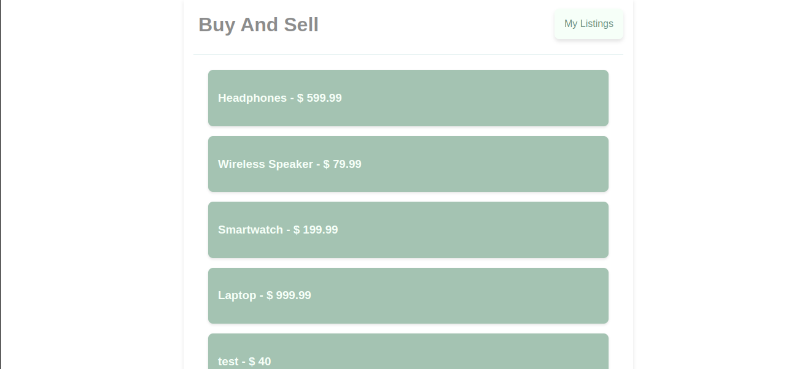
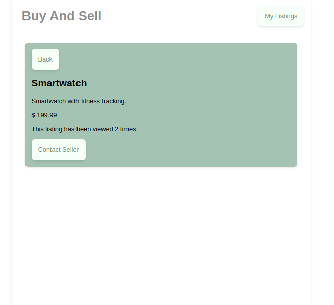
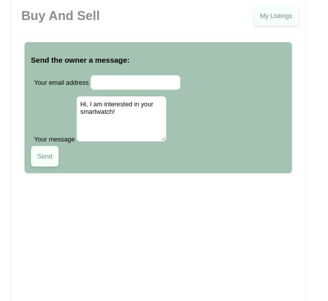
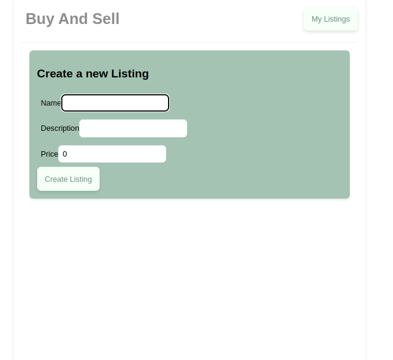
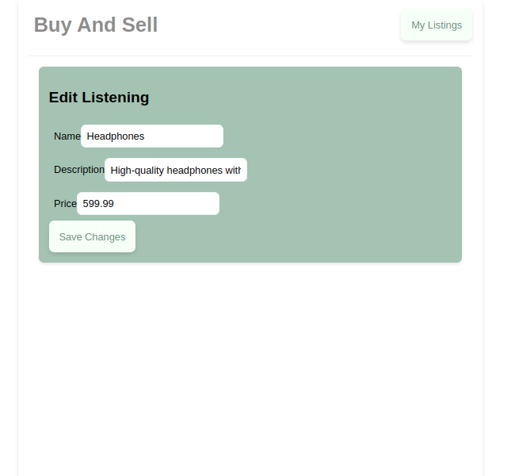
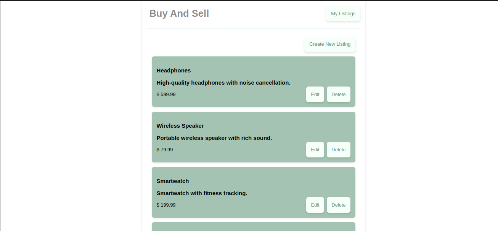

# Angular Full-Stack Project

Welcome to the Angular Full-Stack Project! This project is designed to help you learn how to build a full-stack Angular-powered website from scratch. In this project, we'll be creating an Angular 17 front end and writing a back end in Node.js using hapi. We'll also add PostgreSQL to our back end, connect the front and back ends, add Firebase Authentication to our project, and finally, deploy our full-stack application to the cloud.

## Getting Started

To get started with this project, follow these steps:

1. Clone this repository to your local machine.

2. Install the necessary dependencies by running `npm install` in your terminal.

3. Launch the Angular development server by running `npm start`.

4. Start the Node.js back end server by navigating to the `server` directory and running `npm start`.

5. You're all set! Start exploring the project and building amazing full-stack applications.

## Service CRUD Operations

### Listings Service

The Listings Service is responsible for handling CRUD (Create, Read, Update, Delete) operations related to listings.

#### Get Listings

This operation retrieves a list of all listings from the server.

#### Get Listing by ID

This operation retrieves a single listing by its ID from the server.

#### Add View to Listing

This operation increments the view count of a listing by one.

#### Create Listing

This operation creates a new listing with the provided name, description, and price.

#### Edit Listing

This operation updates an existing listing with the provided ID, name, description, and price.

#### Get Listings for User

This operation retrieves a list of listings created by a specific user.

#### Delete Listing

This operation deletes a listing with the provided ID.

---

Happy coding!

---
